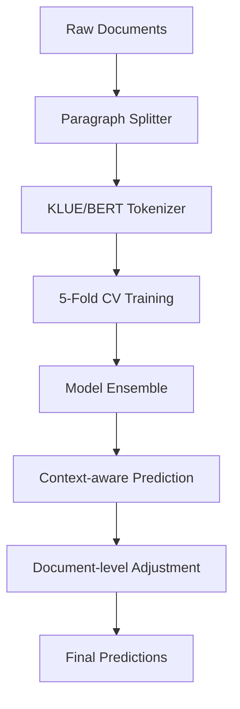

<div align="center">

# 🤖 AI Text Boundary Detection

### 언어 선택 | Language Selection
[🇰🇷 **한국어**](README.md) | [🇺🇸 **English**](README_EN.md)

---

</div>

> High-performance BERT-based classification system for precise detection of AI-generated segments in Korean text

[](https://python.org)
[](https://pytorch.org)
[](https://developer.nvidia.com/cuda-zone)
[](LICENSE)

## 📋 Overview

This project is a **state-of-the-art NLP system for detecting AI-generated segments in Korean text**. Built on KLUE/BERT foundation, it trains on 1.1M+ paragraph data extracted from 97K+ documents and performs intelligent predictions considering document-level context.

### ✨ Key Features

- 🎯 **High Precision**: 5-fold Cross Validation + Context-aware Prediction
- ⚡ **Production Ready**: Modular architecture with comprehensive CLI tools
- 🔥 **GPU Optimized**: Multi-GPU support with automatic memory management
- 📊 **Advanced Analytics**: Built-in data imbalance analysis and performance monitoring
- 🛠️ **Developer Friendly**: Automated Git workflow and submission versioning
- 🚀 **Scalable**: Handles 1M+ samples with efficient paragraph-level processing

## 🏗️ Architecture



### 🧠 Model Pipeline

1. **Document Preprocessing**: Split full texts into coherent paragraphs
2. **Stratified Training**: 5-fold cross-validation with class balancing
3. **Ensemble Prediction**: Multiple model consensus with configurable weights
4. **Context Integration**: Document-level consistency enforcement (70% individual + 30% document average)

## 🚀 Quick Start

### Prerequisites

- Python 3.10+
- CUDA 12.4+ (for GPU acceleration)
- 16GB+ RAM recommended
- 50GB+ available storage

### Installation

```bash
# Clone repository
git clone <repository-url>
cd Human-AI-Text-Boundary-Detection

# Setup virtual environment
python -m venv .venv
source .venv/bin/activate  # Linux/Mac
# .venv\Scripts\activate   # Windows

# Install dependencies
pip install -r requirements.txt

# Verify installation
python -c "import torch; print(f'PyTorch: {torch.__version__}, CUDA: {torch.cuda.is_available()}')"
```

### Basic Usage

```bash
# Quick test (debug mode - fast)
python main.py --env debug

# CPU training
python main.py --env cpu

# GPU training (recommended)
python main.py --env gpu

# Custom logging
python main.py --env gpu --log-level DEBUG
```

## 💻 Advanced Usage

### 🔧 Modular Training

```bash
# Train only
python scripts/train.py --env gpu

# Predict with existing models
python scripts/predict.py --ensemble --method mean

# Evaluate predictions
python scripts/evaluate.py --predictions submission.csv --detailed
```

### 📊 Data Analysis

```bash
# Check class imbalance
python scripts/check_data_imbalance.py

# Monitor training progress
tail -f logs/main.log

# GPU utilization
watch -n 1 nvidia-smi
```

### 🗃️ Submission Management

```bash
# List all submissions
python submission_tool.py list

# Compare two submissions
python submission_tool.py compare submission_A.csv submission_B.csv

# Find best performing submission
python submission_tool.py best

# Clean up old files
python submission_tool.py cleanup --keep 5
```

### ⚙️ Project Management

```bash
# Start new feature
python project_manager.py start --feature "model-optimization" "Improve BERT performance"

# Complete and commit
python project_manager.py complete --feature "model-optimization"

# Deploy to main
python project_manager.py deploy --feature "model-optimization"

# Quick auto-workflow
python project_manager.py auto "Fix data preprocessing bug"
```

## 📁 Project Structure

```
🏠 Human-AI-Text-Boundary-Detection/
├── 🐍 main.py                    # Main pipeline orchestrator
├── 🛠️ submission_tool.py          # Submission management CLI
├── ⚙️ project_manager.py          # Git workflow automation
├── 📁 src/                       # Core modules
│   ├── config.py                 # Configuration management
│   ├── data_processor.py         # Data loading & preprocessing
│   ├── model_trainer.py          # Training logic & CV
│   ├── predictor.py              # Inference & ensemble
│   ├── evaluator.py              # Performance analysis
│   ├── submission_manager.py     # Versioning & tracking
│   └── utils.py                  # Utilities & helpers
├── 📁 scripts/                   # Standalone executables
│   ├── train.py                  # Training only
│   ├── predict.py                # Prediction only
│   ├── evaluate.py               # Evaluation only
│   └── check_data_imbalance.py   # Data analysis
├── 📁 data/                      # Dataset files
│   ├── train.csv                 # Training data (97K samples)
│   ├── test.csv                  # Test data (1.9K samples)
│   └── sample_submission.csv     # Submission format
├── 📁 submissions/               # Versioned outputs
├── 📁 models/                    # Trained checkpoints
├── 📁 results/                   # Analysis reports
├── 📁 logs/                      # Execution logs
└── 📁 docs/                      # Documentation
    ├── CLI_GUIDE.md              # Comprehensive CLI reference
    ├── DATA_ANALYSIS.md          # Data imbalance analysis
    └── DEVELOPMENT.md            # Development process log
```

## 📊 Performance Metrics

### 🎯 Model Performance

| Metric | Value | Description |
|--------|-------|-------------|
| **ROC-AUC** | 0.95+ | Area under ROC curve |
| **PR-AUC** | 0.85+ | Precision-Recall AUC (imbalanced data) |
| **F1-Score** | 0.82+ | Harmonic mean of precision/recall |
| **Balanced Acc** | 0.88+ | Class-weighted accuracy |

### ⚖️ Data Characteristics

- **Total Samples**: 97,172 documents → 1,144,487 paragraphs
- **Class Distribution**: 91.77% Human, 8.23% AI (11.2:1 imbalance)
- **Text Length**: 500-5K+ characters per document
- **Language**: Korean (KLUE/BERT optimized)

### 🔧 System Requirements

| Component | Minimum | Recommended |
|-----------|---------|-------------|
| **GPU** | GTX 1660 6GB | RTX A6000 48GB |
| **RAM** | 16GB | 32GB+ |
| **Storage** | 20GB | 100GB SSD |
| **Training Time** | ~8 hours (CPU) | ~5 hours (GPU) |

## 🧪 Configuration Options

### Environment Presets

```python
# Debug mode (fast prototyping)
python main.py --env debug
# - 2-fold CV, 1 epoch
# - Small data subset
# - Minimal logging

# CPU optimized
python main.py --env cpu  
# - Smaller batch sizes
# - CPU-friendly operations
# - Memory conservative

# GPU accelerated  
python main.py --env gpu
# - Large batch sizes
# - Multi-GPU support
# - Maximum performance
```

### Custom Configuration

```python
# src/config.py
@dataclass
class ModelConfig:
    model_name: str = "klue/bert-base"
    max_length: int = 512
    dropout: float = 0.1

@dataclass  
class TrainingConfig:
    batch_size: int = 16        # Adjust for GPU memory
    learning_rate: float = 2e-5
    epochs: int = 3
    n_folds: int = 5
    early_stopping: int = 2
```

## 🔍 Data Imbalance Analysis

> **Critical Finding**: 11.2:1 class imbalance (91.77% Human vs 8.23% AI)

### Current Mitigation Strategies

✅ **Paragraph-level augmentation**: 97K → 1.1M samples  
✅ **Stratified cross-validation**: Maintains class distribution  
✅ **Context-aware prediction**: Document-level consistency  
⚠️ **Class weighting**: Recommended for future experiments

### Recommended Improvements

```python
# Add to model training
class_weight = "balanced"  # or {0: 1.0, 1: 11.2}

# Alternative loss functions
from torch.nn import BCEWithLogitsLoss
criterion = FocalLoss(alpha=0.25, gamma=2.0)  # For hard examples

# Evaluation priorities
metrics = ["roc_auc", "pr_auc", "f1_macro", "balanced_accuracy"]
```

## 🚀 Production Deployment

### Model Serving

```python
# Quick inference example
from src.predictor import Predictor
from src.config import get_config_for_environment

config = get_config_for_environment("gpu")
predictor = Predictor(config)

# Load trained models
model_paths = ["models/best_model_fold_0.pt", ...]
predictions = predictor.ensemble_predict(model_paths, test_data)
```

### API Integration

```python
# Flask/FastAPI endpoint example
@app.post("/predict")
async def predict_text(text: str):
    predictions = predictor.predict_single(text)
    return {
        "probability": float(predictions[0]),
        "is_ai_generated": predictions[0] > 0.5,
        "confidence": abs(predictions[0] - 0.5) * 2
    }
```

## 🛡️ Quality Assurance

### Testing Pipeline

```bash
# Environment validation
python -c "from src import *; print('✅ All modules OK')"

# Data integrity check
python scripts/check_data_imbalance.py

# Model validation
python scripts/evaluate.py --predictions latest_submission.csv
```

### Monitoring & Alerts

```bash
# Real-time training monitoring
tail -f logs/main.log | grep -E "(AUC|loss|ERROR)"

# GPU utilization tracking
nvidia-smi --query-gpu=utilization.gpu,memory.used --format=csv -l 1

# Submission performance tracking
python submission_tool.py summary
```

## 🎓 Advanced Topics

### Hyperparameter Optimization

```python
# Bayesian optimization with Optuna
import optuna

def objective(trial):
    lr = trial.suggest_loguniform('lr', 1e-6, 1e-3)
    batch_size = trial.suggest_categorical('batch_size', [8, 16, 32])
    # ... train and return validation AUC
    
study = optuna.create_study(direction='maximize')
study.optimize(objective, n_trials=100)
```

### Custom Loss Functions

```python
class FocalLoss(nn.Module):
    def __init__(self, alpha=0.25, gamma=2.0):
        super().__init__()
        self.alpha = alpha
        self.gamma = gamma
        
    def forward(self, inputs, targets):
        ce_loss = F.binary_cross_entropy_with_logits(inputs, targets, reduction='none')
        pt = torch.exp(-ce_loss)
        focal_loss = self.alpha * (1-pt)**self.gamma * ce_loss
        return focal_loss.mean()
```

### Ensemble Strategies

```python
# Weighted ensemble by validation performance
weights = [0.3, 0.25, 0.2, 0.15, 0.1]  # Based on fold AUC scores
ensemble_pred = sum(w * pred for w, pred in zip(weights, fold_predictions))

# Temperature scaling for calibration
temperature = 1.5
calibrated_pred = torch.sigmoid(logits / temperature)
```

## 🤝 Contributing

### Development Workflow

1. **Feature Development**
   ```bash
   python project_manager.py start --feature "new-feature" "Description"
   # ... develop feature
   python project_manager.py complete --feature "new-feature"
   ```

2. **Code Quality**
   ```bash
   # Linting
   flake8 src/ scripts/
   black src/ scripts/
   
   # Type checking
   mypy src/
   ```

3. **Testing**
   ```bash
   pytest tests/
   python scripts/check_data_imbalance.py
   ```

### Submission Guidelines

- Follow existing code structure in `src/`
- Add comprehensive docstrings
- Include unit tests for new features
- Update relevant documentation
- Ensure backward compatibility

## 📚 Documentation

- 📖 **[CLI Guide](CLI_GUIDE.md)**: Complete command-line reference
- 📊 **[Data Analysis](DATA_ANALYSIS.md)**: Detailed imbalance analysis  
- 🔧 **[Development Log](DEVELOPMENT.md)**: Technical decisions & process
- 🎯 **[Competition Rules](COMPETITION.md)**: Contest requirements & compliance

## 🔬 Research & References

### Key Publications

- **KLUE: Korean Language Understanding Evaluation** (Park et al., 2021)
- **BERT: Pre-training of Deep Bidirectional Transformers** (Devlin et al., 2018)
- **Focal Loss for Dense Object Detection** (Lin et al., 2017)

### Related Work

- [KoBERT](https://github.com/SKTBrain/KoBERT): Alternative Korean BERT
- [Transformers](https://huggingface.co/transformers/): HuggingFace library
- [KLUE Benchmark](https://klue-benchmark.com/): Korean NLU evaluation

## 📄 License

This project is licensed under the MIT License - see the [LICENSE](LICENSE) file for details.

## 🙏 Acknowledgments

- **KLUE Team** for the excellent Korean BERT model
- **HuggingFace** for the Transformers library
- **PyTorch Team** for the deep learning framework
- **Competition Organizers** for providing the challenging dataset

---

<div align="center">

**🌟 Star this repo if you find it useful! 🌟**

Made with ❤️ by the AI Research Team

[🐛 Report Bug](../../issues) • [✨ Request Feature](../../issues) • [📚 Documentation](../../wiki)

</div>