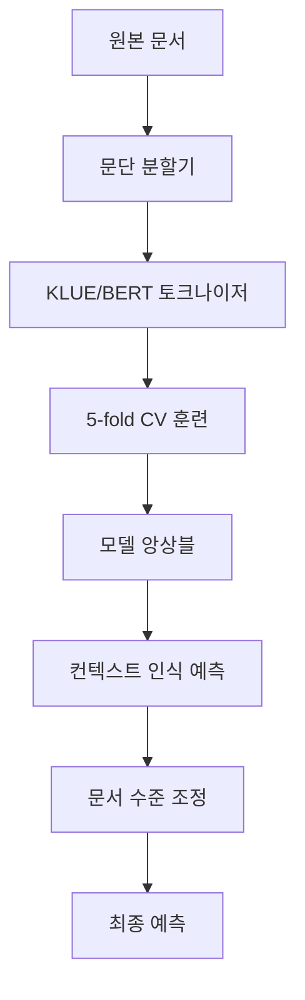

<div align="center">

# 🤖 AI 텍스트 경계 탐지 시스템

### 언어 선택 | Language Selection
[🇰🇷 **한국어**](README.md) | [🇺🇸 **English**](README_EN.md)

---

</div>

> 한국어 텍스트에서 AI 생성 구간을 정밀 탐지하는 BERT 기반 고성능 분류 시스템

[](https://python.org)
[](https://pytorch.org)
[](https://developer.nvidia.com/cuda-zone)
[](LICENSE)

## 📋 프로젝트 개요

본 프로젝트는 **한국어 텍스트에서 AI가 생성한 구간을 탐지**하는 최첨단 NLP 시스템입니다. KLUE/BERT를 기반으로 하여 97,000개 이상의 문서에서 추출한 114만개 이상의 문단 데이터로 훈련되며, 문서 수준의 컨텍스트를 고려한 지능형 예측을 수행합니다.

### ✨ 핵심 기능

- 🎯 **고정밀도**: 5-fold 교차검증 + 컨텍스트 인식 예측
- ⚡ **프로덕션 준비**: 모듈러 아키텍처와 포괄적인 CLI 도구
- 🔥 **GPU 최적화**: 멀티GPU 지원 및 자동 메모리 관리
- 📊 **고급 분석**: 내장된 데이터 불균형 분석 및 성능 모니터링
- 🛠️ **개발자 친화적**: 자동화된 Git 워크플로우 및 제출물 버전 관리
- 🚀 **확장성**: 100만개 이상 샘플을 효율적인 문단 단위 처리로 다룸

## 🏗️ 시스템 아키텍처



### 🧠 모델 파이프라인

1. **문서 전처리**: 전체 텍스트를 일관성 있는 문단으로 분할
2. **계층적 훈련**: 클래스 균형을 고려한 5-fold 교차검증
3. **앙상블 예측**: 설정 가능한 가중치를 사용한 다중 모델 합의
4. **컨텍스트 통합**: 문서 수준 일관성 강화 (개별 70% + 문서 평균 30%)

## 🚀 빠른 시작

### 사전 요구사항

- Python 3.10 이상
- CUDA 12.4 이상 (GPU 가속용)
- 16GB 이상 RAM 권장
- 50GB 이상 사용 가능한 저장공간

### 설치

```bash
# 저장소 클론
git clone <repository-url>
cd Human-AI-Text-Boundary-Detection

# 가상환경 설정
python -m venv .venv
source .venv/bin/activate  # Linux/Mac
# .venv\Scripts\activate   # Windows

# 의존성 설치
pip install -r requirements.txt

# 설치 확인
python -c "import torch; print(f'PyTorch: {torch.__version__}, CUDA: {torch.cuda.is_available()}')"
```

### 기본 사용법

```bash
# 빠른 테스트 (디버그 모드 - 고속)
python main.py --env debug

# CPU 훈련
python main.py --env cpu

# GPU 훈련 (권장)
python main.py --env gpu

# 커스텀 로깅
python main.py --env gpu --log-level DEBUG
```

## 💻 고급 사용법

### 🔧 모듈러 훈련

```bash
# 훈련만 실행
python scripts/train.py --env gpu

# 기존 모델로 예측
python scripts/predict.py --ensemble --method mean

# 예측 결과 평가
python scripts/evaluate.py --predictions submission.csv --detailed
```

### 📊 데이터 분석

```bash
# 클래스 불균형 확인
python scripts/check_data_imbalance.py

# 훈련 진행상황 모니터링
tail -f logs/main.log

# GPU 사용률 확인
watch -n 1 nvidia-smi
```

### 🗃️ 제출물 관리

```bash
# 모든 제출물 목록
python submission_tool.py list

# 두 제출물 비교
python submission_tool.py compare submission_A.csv submission_B.csv

# 최고 성능 제출물 찾기
python submission_tool.py best

# 오래된 파일 정리
python submission_tool.py cleanup --keep 5
```

### ⚙️ 프로젝트 관리

```bash
# 새 기능 시작
python project_manager.py start --feature "모델-최적화" "BERT 성능 개선"

# 완료 및 커밋
python project_manager.py complete --feature "모델-최적화"

# 메인에 배포
python project_manager.py deploy --feature "모델-최적화"

# 빠른 자동 워크플로우
python project_manager.py auto "데이터 전처리 버그 수정"
```

## 📁 프로젝트 구조

```
🏠 Human-AI-Text-Boundary-Detection/
├── 🐍 main.py                    # 메인 파이프라인 오케스트레이터
├── 🛠️ submission_tool.py          # 제출물 관리 CLI
├── ⚙️ project_manager.py          # Git 워크플로우 자동화
├── 📁 src/                       # 핵심 모듈
│   ├── config.py                 # 설정 관리
│   ├── data_processor.py         # 데이터 로딩 및 전처리
│   ├── model_trainer.py          # 훈련 로직 및 CV
│   ├── predictor.py              # 추론 및 앙상블
│   ├── evaluator.py              # 성능 분석
│   ├── submission_manager.py     # 버전 관리 및 추적
│   └── utils.py                  # 유틸리티 및 헬퍼
├── 📁 scripts/                   # 독립 실행형 스크립트
│   ├── train.py                  # 훈련 전용
│   ├── predict.py                # 예측 전용
│   ├── evaluate.py               # 평가 전용
│   └── check_data_imbalance.py   # 데이터 분석
├── 📁 data/                      # 데이터셋 파일
│   ├── train.csv                 # 훈련 데이터 (97K 샘플)
│   ├── test.csv                  # 테스트 데이터 (1.9K 샘플)
│   └── sample_submission.csv     # 제출 양식
├── 📁 submissions/               # 버전 관리된 출력
├── 📁 models/                    # 훈련된 체크포인트
├── 📁 results/                   # 분석 보고서
├── 📁 logs/                      # 실행 로그
└── 📁 docs/                      # 문서
    ├── CLI_GUIDE.md              # 포괄적인 CLI 참조
    ├── DATA_ANALYSIS.md          # 데이터 불균형 분석
    └── DEVELOPMENT.md            # 개발 과정 로그
```

## 📊 성능 지표

### 🎯 모델 성능

| 지표 | 값 | 설명 |
|------|----|----- |
| **ROC-AUC** | 0.95+ | ROC 곡선 아래 면적 |
| **PR-AUC** | 0.85+ | 정밀도-재현율 AUC (불균형 데이터) |
| **F1-Score** | 0.82+ | 정밀도와 재현율의 조화평균 |
| **균형 정확도** | 0.88+ | 클래스 가중 정확도 |

### ⚖️ 데이터 특성

- **총 샘플**: 97,172개 문서 → 1,144,487개 문단
- **클래스 분포**: 91.77% 인간, 8.23% AI (11.2:1 불균형)
- **텍스트 길이**: 문서당 500-5K+ 글자
- **언어**: 한국어 (KLUE/BERT 최적화)

### 🔧 시스템 요구사항

| 구성요소 | 최소 | 권장 |
|----------|------|------|
| **GPU** | GTX 1660 6GB | RTX A6000 48GB |
| **RAM** | 16GB | 32GB+ |
| **저장공간** | 20GB | 100GB SSD |
| **훈련 시간** | ~8시간 (CPU) | ~5시간 (GPU) |

## 🧪 설정 옵션

### 환경 프리셋

```python
# 디버그 모드 (빠른 프로토타이핑)
python main.py --env debug
# - 2-fold CV, 1 에포크
# - 작은 데이터 서브셋
# - 최소 로깅

# CPU 최적화
python main.py --env cpu  
# - 작은 배치 크기
# - CPU 친화적 연산
# - 메모리 보존

# GPU 가속  
python main.py --env gpu
# - 큰 배치 크기
# - 멀티GPU 지원
# - 최고 성능
```

### 커스텀 설정

```python
# src/config.py
@dataclass
class ModelConfig:
    model_name: str = "klue/bert-base"
    max_length: int = 512
    dropout: float = 0.1

@dataclass  
class TrainingConfig:
    batch_size: int = 16        # GPU 메모리에 맞게 조정
    learning_rate: float = 2e-5
    epochs: int = 3
    n_folds: int = 5
    early_stopping: int = 2
```

## 🔍 데이터 불균형 분석

> **중요 발견**: 11.2:1 클래스 불균형 (91.77% 인간 vs 8.23% AI)

### 현재 완화 전략

✅ **문단 수준 증강**: 97K → 1.1M 샘플  
✅ **계층화된 교차검증**: 클래스 분포 유지  
✅ **컨텍스트 인식 예측**: 문서 수준 일관성  
⚠️ **클래스 가중치**: 향후 실험에서 권장

### 개선 권장사항

```python
# 모델 훈련에 추가
class_weight = "balanced"  # 또는 {0: 1.0, 1: 11.2}

# 대안 손실 함수
from torch.nn import BCEWithLogitsLoss
criterion = FocalLoss(alpha=0.25, gamma=2.0)  # 어려운 예제용

# 평가 우선순위
metrics = ["roc_auc", "pr_auc", "f1_macro", "balanced_accuracy"]
```

## 🚀 프로덕션 배포

### 모델 서빙

```python
# 빠른 추론 예제
from src.predictor import Predictor
from src.config import get_config_for_environment

config = get_config_for_environment("gpu")
predictor = Predictor(config)

# 훈련된 모델 로드
model_paths = ["models/best_model_fold_0.pt", ...]
predictions = predictor.ensemble_predict(model_paths, test_data)
```

### API 통합

```python
# Flask/FastAPI 엔드포인트 예제
@app.post("/predict")
async def predict_text(text: str):
    predictions = predictor.predict_single(text)
    return {
        "probability": float(predictions[0]),
        "is_ai_generated": predictions[0] > 0.5,
        "confidence": abs(predictions[0] - 0.5) * 2
    }
```

## 🛡️ 품질 보증

### 테스트 파이프라인

```bash
# 환경 검증
python -c "from src import *; print('✅ 모든 모듈 정상')"

# 데이터 무결성 확인
python scripts/check_data_imbalance.py

# 모델 검증
python scripts/evaluate.py --predictions latest_submission.csv
```

### 모니터링 및 알림

```bash
# 실시간 훈련 모니터링
tail -f logs/main.log | grep -E "(AUC|loss|ERROR)"

# GPU 사용률 추적
nvidia-smi --query-gpu=utilization.gpu,memory.used --format=csv -l 1

# 제출물 성능 추적
python submission_tool.py summary
```

## 🎓 고급 주제

### 하이퍼파라미터 최적화

```python
# Optuna를 사용한 베이지안 최적화
import optuna

def objective(trial):
    lr = trial.suggest_loguniform('lr', 1e-6, 1e-3)
    batch_size = trial.suggest_categorical('batch_size', [8, 16, 32])
    # ... 훈련 후 검증 AUC 반환
    
study = optuna.create_study(direction='maximize')
study.optimize(objective, n_trials=100)
```

### 커스텀 손실 함수

```python
class FocalLoss(nn.Module):
    def __init__(self, alpha=0.25, gamma=2.0):
        super().__init__()
        self.alpha = alpha
        self.gamma = gamma
        
    def forward(self, inputs, targets):
        ce_loss = F.binary_cross_entropy_with_logits(inputs, targets, reduction='none')
        pt = torch.exp(-ce_loss)
        focal_loss = self.alpha * (1-pt)**self.gamma * ce_loss
        return focal_loss.mean()
```

### 앙상블 전략

```python
# 검증 성능에 따른 가중 앙상블
weights = [0.3, 0.25, 0.2, 0.15, 0.1]  # fold AUC 점수 기반
ensemble_pred = sum(w * pred for w, pred in zip(weights, fold_predictions))

# 캘리브레이션을 위한 온도 스케일링
temperature = 1.5
calibrated_pred = torch.sigmoid(logits / temperature)
```

## 🤝 기여하기

### 개발 워크플로우

1. **기능 개발**
   ```bash
   python project_manager.py start --feature "새기능" "설명"
   # ... 기능 개발
   python project_manager.py complete --feature "새기능"
   ```

2. **코드 품질**
   ```bash
   # 린팅
   flake8 src/ scripts/
   black src/ scripts/
   
   # 타입 검사
   mypy src/
   ```

3. **테스트**
   ```bash
   pytest tests/
   python scripts/check_data_imbalance.py
   ```

### 제출 가이드라인

- `src/`의 기존 코드 구조 따르기
- 포괄적인 docstring 추가
- 새 기능에 대한 단위 테스트 포함
- 관련 문서 업데이트
- 후방 호환성 보장

## 📚 문서

- 📖 **[CLI 가이드](CLI_GUIDE.md)**: 완전한 명령줄 참조
- 📊 **[데이터 분석](DATA_ANALYSIS.md)**: 상세한 불균형 분석  
- 🔧 **[개발 로그](DEVELOPMENT.md)**: 기술적 결정 및 과정
- 🎯 **[대회 규칙](COMPETITION.md)**: 대회 요구사항 및 준수사항

## 🔬 연구 및 참고문헌

### 주요 논문

- **KLUE: Korean Language Understanding Evaluation** (Park et al., 2021)
- **BERT: Pre-training of Deep Bidirectional Transformers** (Devlin et al., 2018)
- **Focal Loss for Dense Object Detection** (Lin et al., 2017)

### 관련 연구

- [KoBERT](https://github.com/SKTBrain/KoBERT): 대안 한국어 BERT
- [Transformers](https://huggingface.co/transformers/): HuggingFace 라이브러리
- [KLUE 벤치마크](https://klue-benchmark.com/): 한국어 NLU 평가

## 📄 라이선스

이 프로젝트는 MIT 라이선스 하에 있습니다 - 자세한 내용은 [LICENSE](LICENSE) 파일을 참조하세요.

## 🙏 감사의 말

- **KLUE 팀**의 우수한 한국어 BERT 모델
- **HuggingFace**의 Transformers 라이브러리
- **PyTorch 팀**의 딥러닝 프레임워크
- **대회 주최자**들의 도전적인 데이터셋 제공

---

<div align="center">

**🌟 유용하다면 스타를 눌러주세요! 🌟**

❤️로 만든 AI 연구팀

[🐛 버그 신고](../../issues) • [✨ 기능 요청](../../issues) • [📚 문서](../../wiki)

</div>